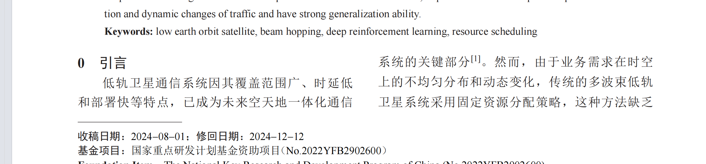
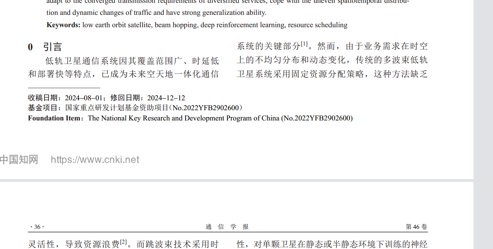

[1]
    
    广泛性
    “With the continuous reduction of satellite launchcosts and the gradual maturity of satellite mass production, the low Earth orbit (LEO) satellite megaconstellations, which can provide seamless coverage,high data rate and low latency, become a hot spot for technological and commercial development and an indispensable component for 60 wireless coverage extension from land to the sea to achieve global three-dimensional seamless coverage ” 引文 段落2 时延低 
    “After 20 years of development, the satellite communication network has entered a new era. According
    to the more than 30 constellation plans that have been
    released worldwide, the satellite communication network shows the following three remarkable features:
    • The LEO satellite constellation has become ahot spot for current development [\19]. Iridium,OneWeb, SpaceX, Amazon and other commercial companies have implemented or announced their ambitious plans for LEO mobile satellite constellations [\12].
    • The large-scale development trend of LEO satellite constellations is significant. The number of LEO satellite constellations has changed fromsmall-scale constellations such as 48 (GlobalStar) and 60 (Iridium) to large-scale constellations such as 720 (OneWeb), 3236 (Kuiper), andmore than 12,000 (Starlink). The most representative constellation is the Starlink constellation,which currently has 1,890 satellites in orbit.
    • The service demands of users are becoming moreand more diversified. Specifically, the service demands of users have       expanded from traditional mobile communication services to broadband Internet services.” 没有提到部署容易的地方 在此表明其成为热点 卫星发射多 服务要求复杂

    论文在阐述低轨（LEO）巨型星座背景时引用了该文献。该文献证明了在未来6G移动通信中，巨型低轨卫星星座能够提供全球覆盖并应对非均匀业务需求。本文以此为背景，说明随着低轨星座规模的迅速膨胀，传统的静态资源分配方式无法满足时空分布极不均匀的地面业务需求，从而引出采用跳波束（Beam Hopping, BH）技术实现按需动态调度卫星资源的必然性和紧迫性 
[2]
    
    "但多波束覆盖区内的不同波束内不同时间段的业务需求并不均匀,导致这种固定模式缺乏足够的灵活性,造成卫星的性能受限。" 引言1(下同 表示引言部分第一段) 
    原文:然而，由于业务需求在时空上的不均匀分布和动态变化，传统的多波束低轨卫星系统采用固定资源分配策略，这种方法缺乏灵活性，导致资源浪费 
[3]
    原文"而跳波束技术采用时间分片技术，在同一时隙中只激活部分波束，从而并解决资源碎片化配置问题[3]，因此其被视为下一代低轨星座通信系统的关键技术。
    "A key requirement for the future multi-beam broadband satellite design is the provision of flexibility to adapt to different traffic demands by re-assigning capacity to beams in accordance with changing traffic distributions.Such flexibility would enable the best match to be maintained between the system resources and traffic demands over the satellite lifetime, thereby greatly enhancing the system utilisation and competitiveness" ABS1 显著提高卫星的资源利用率
    值得注意的是[3] 是和