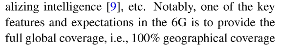
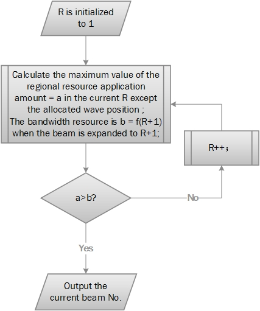
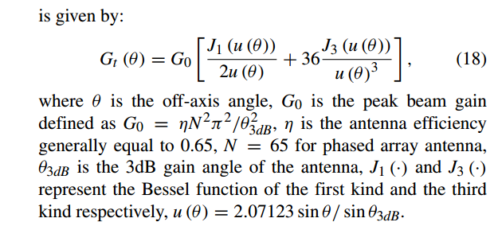
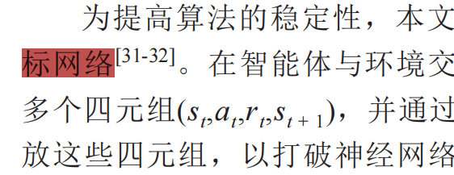

### [1]
    
 原文
广泛性
    
    “With the continuous reduction of satellite launchcosts and the gradual maturity of satellite mass production, the low Earth orbit (LEO) satellite megaconstellations, which can provide seamless coverage,high data rate and low latency, become a hot spot for technological and commercial development and an indispensable component for 60 wireless coverage extension from land to the sea to achieve global three-dimensional seamless coverage ” 引文 段落2 时延低 
    “After 20 years of development, the satellite communication network has entered a new era. According
    to the more than 30 constellation plans that have been
    released worldwide, the satellite communication network shows the following three remarkable features:
    • The LEO satellite constellation has become ahot spot for current development [\19]. Iridium,OneWeb, SpaceX, Amazon and other commercial companies have implemented or announced their ambitious plans for LEO mobile satellite constellations [\12].
    • The large-scale development trend of LEO satellite constellations is significant. The number of LEO satellite constellations has changed fromsmall-scale constellations such as 48 (GlobalStar) and 60 (Iridium) to large-scale constellations such as 720 (OneWeb), 3236 (Kuiper), andmore than 12,000 (Starlink). The most representative constellation is the Starlink constellation,which currently has 1,890 satellites in orbit.
    • The service demands of users are becoming moreand more diversified. Specifically, the service demands of users have       expanded from traditional mobile communication services to broadband Internet services.” 没有提到部署容易的地方 在此表明其成为热点 卫星发射多 服务要求复杂

    论文在阐述低轨（LEO）巨型星座背景时引用了该文献。该文献证明了在未来6G移动通信中，巨型低轨卫星星座能够提供全球覆盖并应对非均匀业务需求。本文以此为背景，说明随着低轨星座规模的迅速膨胀，传统的静态资源分配方式无法满足时空分布极不均匀的地面业务需求，从而引出采用跳波束（Beam Hopping, BH）技术实现按需动态调度卫星资源的必然性和紧迫性 
### [2]

    
        "但多波束覆盖区内的不同波束内不同时间段的业务需求并不均匀,导致这种固定模式缺乏足够的灵活性,造成卫星的性能受限。" 引言1(下同 表示引言部分第一段) 
    
    原文:然而，由于业务需求在时空上的不均匀分布和动态变化，传统的多波束低轨卫星系统采用固定资源分配策略，这种方法缺乏灵活性，导致资源浪费 
### [3]
    原文"而跳波束技术采用时间分片技术，在同一时隙中只激活部分波束，从而并解决资源碎片化配置问题[3]，因此其被视为下一代低轨星座通信系统的关键技术。

    "A key requirement for the future multi-beam broadband satellite design is the provision of flexibility to adapt to different traffic demands by re-assigning capacity to beams in accordance with changing traffic distributions.Such flexibility would enable the best match to be maintained between the system resources and traffic demands over the satellite lifetime, thereby greatly enhancing the system utilisation and competitiveness" ABS1 显著提高卫星的资源利用率
    
    值得注意的是[3] 是"灵活的行波管（TWT）和多端口放大器来提供可变的每波束功率，以及使用模拟或数字处理器根据需求分配每波束带宽[1]。另一种可能具有明显优势的方法是使用波束跳跃技术，其中在任意时刻仅点亮部分波束. 这将导致一个具有预定义重复率或“窗口”长度的时间和空间传输计划[2]。"作为10年的文章 我们知道后面跳波束大获全胜(行波管则再没出现在我所查的论文中)

### [4]   
    原文：
    文献[4]和文献[5-6]分别使用遗传算法
    和启发式算法进行跳波束系统资源分配，以提高系
    统的吞吐量。
    由于需要优化的独立参数数量众多，可能解空间的维度很大，加上容量函数的高度非线性行为，选择了遗传算法（GAs）。
“
Given the large number of independent parameters to be optimized and the large dimension of the possible solution space, together with the highly non linear behavior of the capacity function, genetic algorithms (GAs) have been selected.

众所周知，遗传算法基于创建一个环境，在该环境中，可能解的群体竞争并进化直到最适应的个体生存。

As it is well known from literature, GAs are based on the creation of an environment where a population of possible solutions competes and evolves until the fittest individual survives.

在随后的优化中，适应度函数被假设等于系统的总吞吐量T。

In the following optimizations, the fitness function has been assumed equal to the total system throughput T. Some fairness criteria could in general be introduced to shape the resulting available capacity profile: as an example, one may think of guaranteeing the provision of a certain ratio of the traffic demand per beam , or of a certain minimum constant throughput per beam.

通常可以引入一些公平性标准来塑造最终可用容量的分布：例如，可以考虑保证每个波束提供一定比例的交通需求，或每个波束提供一定的最小恒定吞吐量。

However, in the following, the simple capacity maximization has been assumed.
....
交叉算子。

Crossover operator.

在波束跳变计划上配置该算子有许多选项，但最有效的方法是（由于染色体的固有结构）在于在槽水平上重组所选择的父母，即，每对夫妇产生两个孩子，这是由祖细胞槽的均匀随机组合产生的。

Many options are available to configure this operator on the beam hopping plan but the most effective method (due to the inherent structure of the chromosome) consist on recombining the selected parents at slot level, i.e. every couple generate two children, resulting from the uniform random combination of the genitors’ slots.

在频率规划方面，考虑两种机制。

On the frequency plan’s side, two mechanisms are considered.

当跨越两个槽时，出现在这两个波束中的波束联合收割机均匀地组合其载波，否则，载波分布被另一个随机产生的波束所替代。

When crossing two slots, those beams appearing in both of them combine uniformly its carriers.

突变机制。

Otherwise, the carrier distribution is substituted by another randomly generated.

以类似的方式，必须从波束跳变计划和频率计划的角度考虑突变算子。

Mutation mechanism.

在波束计划上，突变包括在时隙中引入新的和非重复的波束，或者断开已经照射的波束之一。

In a similar way, the mutation operator must be considered from both the beam hopping plan and the frequency plan point of view.

在频率计划侧，该突变提供了波束平面的一个照射波束中的仅一个载波的变化。

On the Beam Plan, a mutation consists on the introduction of either a new and non-repeated beam in a time slot, or the disconnection of one of the beams already illuminated.

On the Frequency Plan side, the mutation provides a change in only one of the carriers in one of the illuminated beams of the Beam Plan.
"
这里用遗传算法
有五个步骤
(1) 初始化种群（Initialization）：随机生成一定数量的初始个体构成第一代种群。

(2)适应度评估（Fitness Evaluation）：计算种群中每个个体对应的目标函数值及适应度。

(3)选择（Selection）：根据适者生存原则，从当前种群中选择优良个体遗传到下一代（常用方法如轮盘赌选择、锦标赛选择）。

(4)交叉/杂交（Crossover）：以一定概率将两个父代个体的基因进行重组，生成新的子代个体，这是产生新解的主要方式。

(5)变异（Mutation）：以较小概率随机改变个体基因中的某些位，用以保持种群的多样性，防止算法过早陷入局部最优解（早熟

上述过程（评估 $\rightarrow$ 选择 $\rightarrow$ 交叉 $\rightarrow$ 变异）不断循环迭代，直到达到预设的终止条件（如达到最大迭代次数或解的适应度趋于稳定）

注:染色体/个体（Chromosome / Individual）：问题的潜在可行解，通常采用二进制编码、实数编码或符号编码表示。

种群（Population）：由多个个体组成的集合，代表搜索空间中的一组候选解。

适应度函数（Fitness Function）：用于评估个体优劣的标准，适应度值越高，说明该解越接近最优解A

### [5]
暂无数据 文章下不了 南邮没买

### [6]
作者针对传统跳波束（Beam Hopping, BH）资源分配算法只关注固定波束半径、向需求最大波位分配资源而忽视波束覆盖范围灵活性等问题，提出了一种基于业务分布动态调整波束尺寸（Beam Size）的启发式资源管理算法。
1. 算法核心思想
    传统跳波束系统中，单个波束的覆盖半径/照射面积通常是固定不变的。文献[6]引入了波束形状/覆盖范围的可变维度：
    
    当某一区域业务密度较高且分布分散时，通过放大波束覆盖尺寸，一次性覆盖更多波位/用户，从而提高用户的接入率并充分利用波束带宽。
    
    当业务相对集中时，通过缩小波束尺寸集中能量与资源服务重点区域
    算法的核心逻辑围绕业务分布感知、波束尺寸调整与时隙/带宽调度展开：

业务需求与优先级评估：

    收集各个波位/区域的实时业务需求（Traffic Demand）以及不同业务的服务质量（QoS）优先级（如时延敏感型或吞吐量敏感型业务）。
    
    动态波束尺寸调整（Beam Size Adjustment）：
    
    建立业务分布模型，根据各区域的业务密度与用户分布情况，启发式地计算最佳波束覆盖半径与照射位置。
    
    扩大波束半径以覆盖更多具有不均匀业务需求的邻接波位，降低未服务波位的等待概率。
    
    时隙与资源匹配调度：
    
    在动态波束覆盖的基础上，结合业务优先级进行时隙（Time Slot）和带宽资源的二次分配。
    
    优先保障高 QoS 优先级业务的传输要求，同时兼顾整体系统容量与丢包率。

自注:
    释义 :启发式资源管理算法，核心思想是在复杂、动态的环境中，不追求数学上的绝对最优解，而是用一套基于经验、规则或智能搜索的“启发式策略”，在可接受的时间和成本内，快速找到一个足够好的可行

    引自百度: 
    启发式算法（heuristic algorithm)是相对于最优化算法提出的。一个问题的最优算法求得该问题每个实例的最优解。启发式算法可以这样定义：一个基于直观或经验构造的算法，在可接受的花费（指计算时间和空间）下给出待解决组合优化问题每一个实例的一个可行解，该可行解与最优解的偏离程度一般不能被预计。现阶段，启发式算法以仿自然体算法为主，主要有蚁群算法、模拟退火法、神经网络等。

　举例

启发式算法家族庞大，主要包括以下几种类型：
    
    优先规则启发式 (Priority Rule-based Heuristics)：通过设定简单规则（如任务截止时间最早者优先）来快速决策。优点是简单、快速、易于实现，但解的质量依赖于规则的设计。
    
    元启发式算法 (Metaheuristics)：
        更高级的搜索策略，擅长全局搜索，避免陷入局部最优。常见的有：
    
    蚁群算法 (ACO)：
        模拟蚂蚁觅食，通过“信息素”和“启发式信息”共同作用寻找最优路径。
    
    粒子群算法 (PSO)：
        模拟鸟群觅食，通过个体与群体协作寻找最优解。
    
    遗传算法 (GA)：
        模拟生物进化，通过选择、交叉、变异等操作迭代优化。
    
    禁忌搜索 (TS)：
        通过禁忌表记录已搜索过的解，避免重复和陷入局部循环。
    
    超启发式算法 (Hyper-heuristics)：
        一种“管理启发式算法”的算法。它不直接解决问题，而是在更高层次上选择或组合不同的简单启发式算法，以实现更优的性能。
    
    特定领域启发式：
        针对特定问题设计的算法，例如结合经济学原理进行资源定价的算法，或基于嵌套分割法（Nested Partitions）的供应链资源分配算法。
    

### [7]
    原文:以降低系统业务时延为目标，
    文献[7]采用梯度理论推导出数据包排队时延的闭
    式解，有效减少了业务等待时间

由于跳频速率远低于分组到达速率的物理限制，理想的先来先服务分组调度是不可能实现的，这迫使我们转而追求最优的时隙调度
Due to the physical limitation that hopping speed is much slower than packet arrival speed, the ideal first-come-first-serve packet scheduling is not realizable, which compels us to pursuit the optimal slot scheduling instead.
为了处理复杂的随机规划问题，我们引入了分时原理来解耦变量，并采用随机梯度理论推导出了次优的封闭解。
To deal with the complex stochastic programming problem, we introduce the time-sharing principle to uncouple the variables and adopt stochastic gradient theory to deduce the suboptimal close-form solution.
ABS1

4.2 Optimization of visiting time duration
via stochastic gradient theory
According to the SGT [20], in order to obtain the long-term
optimization of the efficiency function fðÞ, we just need to
maximize its increment between two conjunct BHWs.根据SGT [20]，为了获得效率函数f的长期优化，我们只需要最大化两个合取BHW之间的增量
梯度优化见《Python 与人工智能基础》2.1线性回归部分 简述当为设立预测值$\hat{y}$
设计奖励函数L 通过梯度下降求出L的最佳参数
过程类似 统概的最大似然估计 但是这里下降的步长是有要求的（学习率） 求出的是残差平方和的最小值

引文：
    拉格朗日乘子法。 Lagrange multiplier method
[拉格朗日乘子法](obsidian://open?vault=%E8%8B%8F&file=%E5%BA%937.27%2F%E6%8B%89%E6%A0%BC%E6%9C%97%E6%97%A5%E4%B9%98%E5%AD%90%E6%B3%95)
我们引入一个拉格朗日乘子B来联合收割机约束表达式，得到拉格朗日量如下。
we introduce a Lagrange multiplier b to combine the constrained expression, obtaining the Lagrangian as follows
# -=【7】未看完 稍后继续

### [8]
    文献[8]通过将
    波束位置划分问题转化为p-center问题，实现了用
    最少的波束位置覆盖所有用户，从而降低数据排队
    时延。

可以看到原文还是借鉴了引文[8]的这方面 又或许这是常识

此时注意 min{} 和min() 和 min  是不同的
前两者是取后面的范围中的最小值和几个数中的最小值
后一个可以视作动词用  $ min f(x) $或是 $ min_x f(x) $
表示求解使目标函数 f(x)取得最小值的自变量x。

p-Center 问题定义：运筹学中的经典设施选址问题，旨在区域内挑选 $p$ 
个服务中心（即波束中心），使得所有被服务点（地面用户/业务点）
到其最近服务中心的最大距离最小（或在满足覆盖要求的条件下使中心数量 $p$ 最小）
Tang 等 - 2021 - [8]Optimization Method of Dynami
c Beam Position for LEO Beam-Hopping Satellite Communi
cation Systems.pdf]。

实体映射：需求点：地面实际存在通信需求的活跃用户或小区节点服务中心：跳
波束卫星在足迹区域内动态生成的波束照射中心
优化目标：根据实时用户分布与业务流量分布，以最少数量的波位
（最小化 $p$ 值）实现对当前所有活跃业务的完整覆盖

步骤1 随机取得三个点为服务中心
步骤2 最小化距离 
步骤3 重排 思考是否有更优center点

### [9]
    文献[9]提出一
    种以最大化吞吐量为目标的深度强化学习算法，用
    于优化跳波束系统容量。
提出了一种基于深度强化学习的联合优化算法，对跳束调度和覆盖控制进行联合优化（称为DeepBeam），它灵活地使用了时间、空间和波束覆盖半径三个自由度，此外，为了降低计算复杂度和加速DeepBeam的训练，我们首先为波束之一训练单个模型，然后以轮询方式为每个波束使用该训练模型来确定要被照射的小区和波束覆盖。
```mermaid   

   Plaintext
    
    ```
    ┌────────────────────────────────────────────────────────────────────────┐
    │                              [系统初始化]                               │
    └───────────────────────────────────┬────────────────────────────────────┘
                                        │
                                        ▼
    ┌────────────────────────────────────────────────────────────────────────┐
    │                        [构建状态矩阵 S_t]                               │
    │                   (包含各小区 Buffer 延迟数据包)                          │
    └───────────────────────────────────┬────────────────────────────────────┘
                                        │
                                        ▼
    ┌────────────────────────────────────────────────────────────────────────┐
    │                    [多波束轮询决策 (Beam 1 到 K)]                      │
    │                                                                        │
    │   ├── 1. 输入当前伪状态 S_{t,k} 到 Q-Network                            │
    │   ├── 2. 输出动作 a_{t,k} = (中心小区ID, 覆盖半径)                       │
    │   ├── 3. 模拟执行动作，计算伪奖励 r_{t,k}                                │
    │   ├── 4. 状态伪更新得到 S_{t,k+1}                                        │
    │   └── 5. 存储转移元组 (S_{t,k}, a_{t,k}, r_{t,k}, S_{t,k+1}) 到 Replay Buffer│
    └───────────────────────────────────┬────────────────────────────────────┘
                                        │
                                        ▼
    ┌────────────────────────────────────────────────────────────────────────┐
    │                            [环境真实执行]                               │
    │      (星载波束真正执行联合动作 A_t，环境状态转移至真实 S_{t+1})           │
    └───────────────────────────────────┬────────────────────────────────────┘
                                        │
                                        ▼
    ┌────────────────────────────────────────────────────────────────────────┐
    │                        [Q-Network 训练更新]                             │
    │       (从 Replay Buffer 采样 Minibatch，更新当前 Q 网与 Target 网)      │
    └────────────────────────────────────────────────────────────────────────┘
```
单模型复用与轮询机制（Polling Manner）：训练时，将单个“波束”作为独立智能体（Agent）训练出单一模型。  应用时，卫星上的多个波束以轮询（Round-robin）的方式共享并调用这同一个模型来做出调度策略。
这大幅降低了动作空间和计算复杂度。

状态伪更新技术（Pseudo-updates）：
在同一时隙内，轮询各个波束做决策时，算法会对环境状态进行伪更新
（假定前面已决策波束执行了动作并更新了状态）。
这能防止多个波束在同一时刻输出完全相同的重复策略

网络结构与训练 (Deep Q-Network)：
CNN 骨干：利用卷积神经网络（CNN）来提取小区通信需求分布的空间结构特征。  
双网络与经验回放：采用目标网络（Target Network）
与策略网络（Policy Network）的双网络架构减少 Q 值过估计，并引入经验回放池（Replay Buffer）提高训练稳定性。

<br><br><br><br>
[马尔可夫决策过程 (MDP)](obsidian://open?vault=%E8%8B%8F&file=%E5%BA%937.27%2F%E9%A9%AC%E5%B0%94%E5%8F%AF%E5%A4%AB%E5%86%B3%E7%AD%96%E8%BF%87%E7%A8%8B%EF%BC%88Markov%20Decision%20Process%2C%20MDP%EF%BC%89)
构建：

状态空间 ($S_t$)：由卫星缓冲区（Buffer）中记录的各小区在最大可忍受排队延迟内的待服务数据包需求矩阵构成。  

动作空间 ($a_k$)：动作是二维的，包含
波束照射的目标中心小区 ID（$n_t$）以及
波束的覆盖半径（$\chi_t^k$）。  

奖励函数 ($r$)：定义为系统在当前时隙内实际成功传输的数据包总量（即系统实时吞吐量）


**可以看到** 这里和**原文2.2** 说明是一个马尔可夫过程 
在之后的算法1部分是有体现的
下面是MDP(马尔可夫决策过程)
### 1. MDP 的核心五元组
一个标准的MDP通常由以下五个元素定义（记作 \( (S, A, P, R, \gamma) \)）：

- **状态空间（\( S \)）**：环境在某一时刻的所有可能情形。例如，在围棋中，状态就是当前棋盘上所有棋子的布局。
- **动作空间（\( A \)）**：智能体在某个状态下可以采取的所有操作。例如，机器人可以选择“向左转”或“向前走”。
- **状态转移概率（\( P \)）**：核心动力学函数，记作 \( P(s' | s, a) \)。它表示智能体在状态 \( s \) 执行动作 \( a \) 后，环境转移到下一个状态 \( s' \) 的概率。
- **奖励函数（\( R \)）**：记作 \( R(s, a) \) 或 \( R(s, a, s') \)。它定义了智能体在状态 \( s \) 执行动作 \( a \) 后，环境即时反馈给智能体的数值信号。奖励是智能体优化目标的唯一依据。
- **折扣因子（\( \gamma \in [0, 1] \)）**：用于平衡**即时奖励**和**未来奖励**的权重。\( \gamma \) 越接近 0，智能体越“短视”；越接近 1，智能体越“有远见”。
#### 注意 核心假设在马尔可夫性 即非时效性


轮询机制（Polling Manner）是降维与实现模型高度复用的核心设计 <br>
从底层数据结构看，轮询的本质是一个环形队列（Circular Queue）。<br>
维护一个当前索引指针 index，每次分配时取 array[index]，然后执行 index = (index + 1) % N（N为总数）。<br>
这种实现保证了分配周期的确定性和 O(1) 的时间复杂度。
